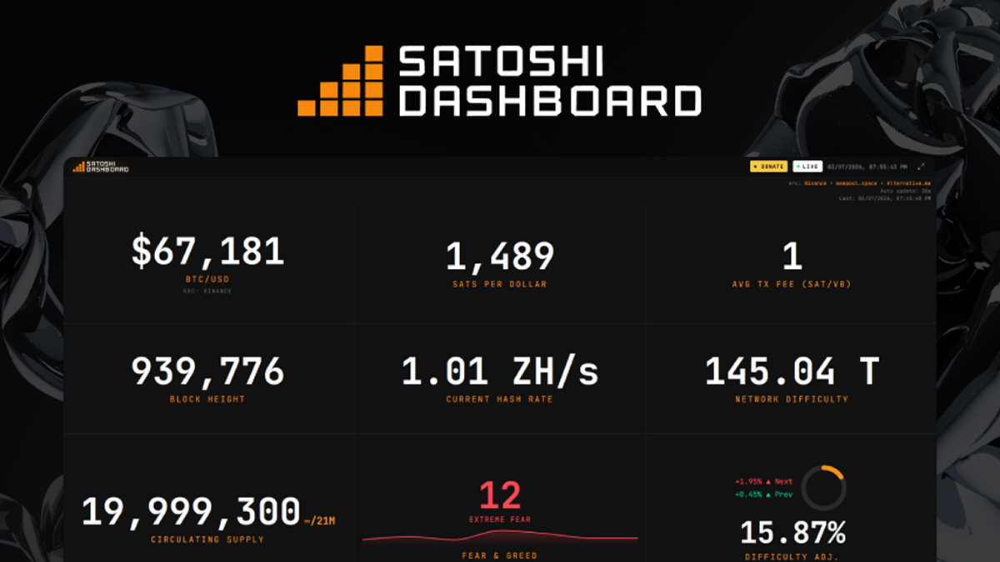

<div align="center">
  <h1>Satoshi Dashboard</h1>
 
  <p>
    <strong>An open-source Bitcoin dashboard focused on market context, network data, macro comparison, and honest source attribution.</strong>
  </p>
  <p>
    
    
    
    
  </p>
  <p>
    Satoshi Dashboard turns scattered Bitcoin metrics into a calmer, one-module-at-a-time experience. It combines live market and network modules, public editorial routes, a cache-aware API layer, and explicit source transparency instead of hiding refresh limits or fallback behavior.
  </p>
</div>

<details>
  <summary>Table of Contents</summary>
  <ol>
    <li><a href="#general-description">General Description</a></li>
    <li><a href="#system-architecture">System Architecture</a></li>
    <li><a href="#tech-stack">Tech Stack</a></li>
    <li><a href="#product-surface">Product Surface</a></li>
    <li><a href="#module-status">Module Status</a></li>
    <li><a href="#data-and-api-philosophy">Data and API Philosophy</a></li>
    <li><a href="#security-model">Security Model</a></li>
    <li><a href="#local-development">Local Development</a></li>
    <li><a href="#environment-variables">Environment Variables</a></li>
    <li><a href="#deployment">Deployment</a></li>
    <li><a href="#community">Community</a></li>
    <li><a href="#contributing">Contributing</a></li>
    <li><a href="#maintainer-docs">Maintainer Docs</a></li>
    <li><a href="#license">License</a></li>
  </ol>
</details>

## General Description

Satoshi Dashboard is a React + Vite application with an Express API layer built for people who want more than a price ticker. The project presents Bitcoin price action, mempool activity, Lightning, macro comparisons, and educational modules in a guided interface where each module can stand on its own.

The product is designed around three principles:

- Honest source attribution
- Resilient cached delivery with stale-safe fallbacks
- A readable UI that favors context over noise

## System Architecture

```text
┌──────────────────────┐
│      Frontend        │
│  React 19 + Vite 7   │
│  Module player + SEO │
└──────────┬───────────┘
           │ /api/*
           ▼
┌──────────────────────┐
│    Express API       │
│ server/app.js        │
│ cache-first routing  │
└──────────┬───────────┘
           │
           ├───────────── Binance / Binance.US
           ├───────────── mempool.space
           ├───────────── Alternative.me
           ├───────────── Bitnodes / BitInfoCharts
           ├───────────── BTC Map / Natural Earth
           └───────────── Internal API endpoints
```

Runtime targets:

- Frontend bundle: Vercel-friendly SPA
- API runtime: local Node server or `api/index.js` on Vercel
- Cache model: in-memory first, optional shared KV second, stale fallback when upstream refreshes fail

## Tech Stack

- React 19
- React Router 7
- Vite 7
- Express 4
- Tailwind CSS 4
- Recharts
- Leaflet / React Leaflet
- Vercel Analytics
- Vercel Speed Insights

## Product Surface

Primary routes:

- `/` - first live module
- `/module/:slug` - module player
- `/landingpage` - public landing route
- `/landingpage/blog` - blog index
- `/landingpage/blog/:slug` - blog article route

What you can explore today:

- Live price and chart modules
- Mempool, Bitnodes, and Lightning views
- BTC Map adoption density
- Stablecoin, Fear and Greed, and macro comparison modules
- Experimental preview modules clearly separated from fully live ones

## Module Status

- Total registry modules: `32`
- Live and indexable modules: `21`
- Under-construction modules: `11`
- Legacy `/bitcoin-dashboard/*` routes still redirect to the current player structure

Current live/indexable set:

- `S01-S18`
- `S30`
- `S31`
- `S32`

Under-construction set:

- `S19-S29`

The source of truth for module identity, order, code, and slug generation is `src/features/module-registry/modules.js`.

## Data and API Philosophy

Satoshi Dashboard treats the API layer as part of the product, not just glue code.

- Upstream providers are wrapped behind cache-aware endpoints
- Expensive refreshes use single-flight locking
- Stale payloads can be served when upstreams fail or another refresh is already in progress
- Frontend modules usually keep the last good UI state during transient failures
- Public responses include `x-request-id` so incidents can be traced across logs and client sessions

Important security boundary:

- The browser must never call private upstream providers, scraper infrastructure, Redis/KV, or admin refresh routes directly
- The frontend should only talk to the local app origin and its controlled `/api/*` surface
- Treat this repository's API as an application backend, not as a public data product for third parties
- If a feed is sensitive, expensive, or operationally revealing, keep it server-side and expose only the minimum derived payload the UI needs

Examples of real upstream dependencies used across the dashboard:

- Binance / Binance.US for BTC spot and price history
- mempool.space for Bitcoin network and Lightning data
- Alternative.me for Fear and Greed
- Bitnodes and BitInfoCharts for network and address distribution views
- BTC Map and Natural Earth for geographic modules
- Internal API endpoints for selected comparative and macro feeds

## Security Model

This project is intentionally designed to reduce unnecessary public exposure.

Core rules:

- Do not embed upstream API keys, private base URLs, refresh tokens, or infrastructure hostnames in client-side code
- Do not document internal-only endpoints as if they were public developer APIs
- Do not expose raw scraper backends directly to browsers; place them behind the dashboard API layer
- Do not allow unrestricted cache refresh or administrative operations from the public internet
- Do not bind local development services to wider interfaces unless there is a clear operational reason

Recommended hardening posture:

- Keep `SCRAPER_BASE_URL` pointed to a private/internal service, VPN-only host, or restricted gateway
- Use `REFRESH_API_TOKEN` for any explicit refresh/admin paths and rotate it like a secret
- Apply strict rate limits to public read routes and stricter limits to refresh routes
- Return normalized, minimal JSON payloads instead of raw upstream responses whenever possible
- Avoid leaking provider-specific internals in error messages, logs returned to clients, or response bodies
- Prefer server-to-server calls, short upstream timeouts, stale cache fallback, and fail-closed behavior for sensitive operations
- Store secrets only in environment variables or the deployment platform secret manager, never in Git

Public vs private surface:

- Safe to expose: the frontend app, the minimum `/api/*` routes needed by the UI, static assets, and health/security checks required by deployment
- Keep private: scraper hosts, refresh/admin endpoints, Redis/KV credentials, upstream tokens, internal dashboards, and any route that can amplify cost or reveal infrastructure topology

If you do not want your APIs to be publicly consumable as a generic service, keep the architecture opinionated:

- frontend -> same-origin app backend -> private upstreams
- never frontend -> private upstreams
- never public docs that encourage third-party dependence on internal feeds

## Local Development

Requirements:

- Node.js 20+
- npm 10+

Install and run:

```bash
npm install
npm run dev
```

Useful scripts:

```bash
npm run dev
npm run dev:ui
npm run dev:api
npm run build
npm run preview
npm run start:api
npm run check:security
npm run lint
```

Notes:

- `npm run dev` starts UI and API together
- `npm run preview` serves the built frontend only, so use `npm run start:api` in another terminal if you need live `/api/*` responses
- Local `/api` proxy behavior depends on `API_PROXY_TARGET`
- For safer local testing, prefer loopback-only targets such as `127.0.0.1` instead of broad LAN exposure

## Environment Variables

Core runtime variables:

```env
API_PORT=8787
API_HOST=127.0.0.1
API_PROXY_TARGET=http://127.0.0.1:8787
TRUST_PROXY=
REFRESH_API_TOKEN=your_refresh_token
PUBLIC_API_RATE_LIMIT_MAX=60
REFRESH_API_RATE_LIMIT_MAX=10
SCRAPER_BASE_URL=https://your-private-internal-api.example.com
SUPABASE_PROJECT_URL=
SUPABASE_ANON_KEY=
SUPABASE_FUNCTIONS_JWT=
KV_REST_API_URL=
KV_REST_API_TOKEN=
UPSTASH_REDIS_REST_URL=
UPSTASH_REDIS_REST_TOKEN=
```

Copy `.env.example` to `.env` when needed.

Security notes:

- `API_HOST=127.0.0.1` is the safer default for local development; only use `0.0.0.0` when you intentionally need LAN access
- Leave `TRUST_PROXY` unset unless you need a known proxy hop or subnet; never use a blanket `true`
- `SCRAPER_BASE_URL` should point to a non-public backend whenever possible
- `SUPABASE_PROJECT_URL` and `SUPABASE_FUNCTIONS_JWT`/`SUPABASE_ANON_KEY` must be set explicitly for the internal BTC queue backend; do not hardcode production Supabase URLs in code or env examples
- `REFRESH_API_TOKEN`, KV tokens, and Redis tokens are secrets and must never be committed
- If you deploy to Vercel or another platform, store all secrets in the platform secret manager instead of checked-in files

For a reference scraper implementation, see `https://github.com/Satoshi-Dashboard/api-scraper`.

## Deployment

The repository is designed to stay compatible with Vercel.

- SPA routes rewrite to `index.html`
- API traffic resolves through `api/index.js`
- The same Express app used locally is reused for the deployed API surface
- Built assets under `/assets/*` are served with immutable cache headers
- HTML and API responses remain on rewrite-driven delivery so deploys propagate cleanly

Deployment security guidance:

- Put the public app behind the smallest possible public surface
- Keep scraper/upstream infrastructure separate from the public frontend domain when possible
- Restrict admin/refresh routes to localhost, trusted IP space, or token-protected workflows
- Review CORS, cache headers, CSP, rate limits, and error-body hygiene before every production release

Recommended validation before shipping:

```bash
npm run build
npm run check:security
```

## Community

Satoshi Dashboard is an open-source project and we welcome contributors from all backgrounds. Our community is built on transparency, respect, and collaboration.

### Community Standards

- **[CODE_OF_CONDUCT.md](./CODE_OF_CONDUCT.md)** - Community guidelines for respectful and inclusive participation
- **[SECURITY.md](./.github/SECURITY.md)** - Security policy and responsible disclosure process
- **[CONTRIBUTING.md](./.github/CONTRIBUTING.md)** - Complete guide for contributing code, docs, and ideas

### Quick Links

- 🐛 **Found a bug?** → Open an issue with the bug report template
- ✨ **Have an idea?** → Start a Discussion to propose features
- 📚 **Documentation?** → Help improve our guides and examples
- 🔍 **Code review?** → Review open PRs and provide feedback
- 💬 **Want to chat?** → Join our [Discord community](https://discord.gg/67GKKyqwyh) for real-time discussion

## Contributing

We follow a structured contribution process to maintain code quality and project integrity.

### For Contributors

1. **Read the guidelines** - Start with [CONTRIBUTING.md](./.github/CONTRIBUTING.md)
2. **Fork and setup** - Clone the repo and install dependencies (`npm install`)
3. **Create a branch** - Use descriptive names: `feature/`, `bugfix/`, `docs/`
4. **Keep data honest** - Maintain data sourcing and refresh semantics as documented
5. **Validate locally** - Run `npm run lint`, `npm run build`, and `npm run check:security`
6. **Submit a PR** - Use the PR template and link related issues

### Data Sourcing Principles

When contributing changes that affect data flows:

- All upstream providers must be clearly attributed
- Cache semantics and fallback behavior must be explicit
- Do not hide refresh limits or provider failures behind silent fallbacks
- Stale payloads are acceptable only when clearly documented and user-visible

### Code Standards

Follow the style and patterns established in the project:
- Frontend: React 19 with hooks, Tailwind CSS for styling
- Backend: Express 4 with cache-aware routing and explicit error handling
- All code must pass linting: `npm run lint`

### Before Every Commit

```bash
npm run lint --fix      # Fix style issues
npm run build           # Validate build
npm run check:security  # Check for vulnerabilities
```

## Maintainer Docs

Internal repo policy and agent-facing docs live in `.claude/`.

- `.claude/agent-runtime/AGENTS.md`
- `.claude/repo/PROJECT_STRUCTURE.md`
- `.claude/BACKEND_API_RULES.md`
- `.claude/DATA_SOURCE_INTEGRITY_RULES.md`
- `.claude/MODULE_REGISTRY_RULES.md`
- `.claude/FRONTEND_COLOR_UX_UI_RULES.md`

## License

This project is licensed under the MIT License. See `LICENSE.txt`.
